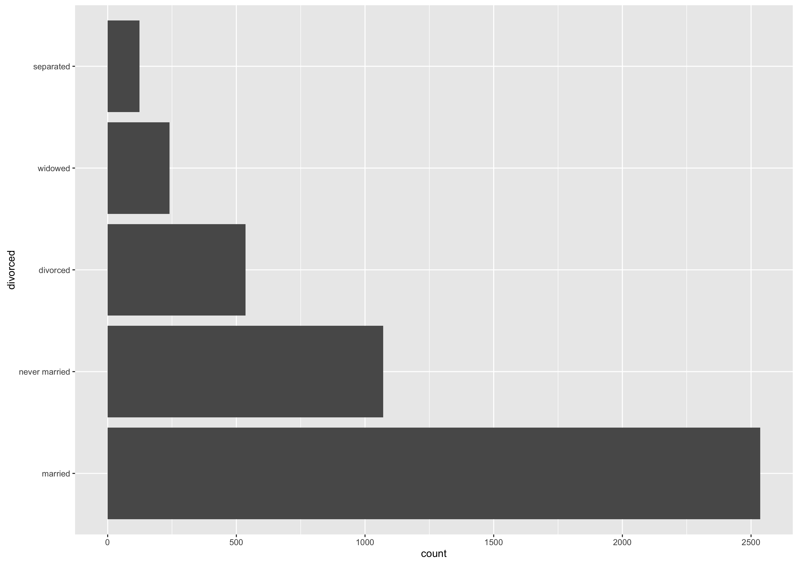
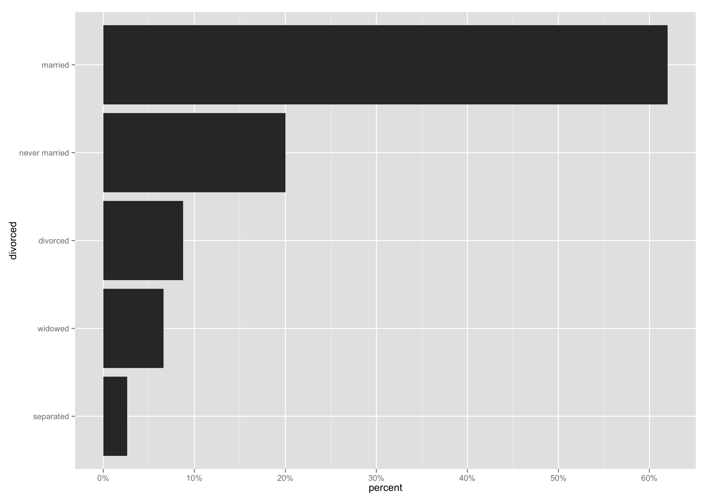
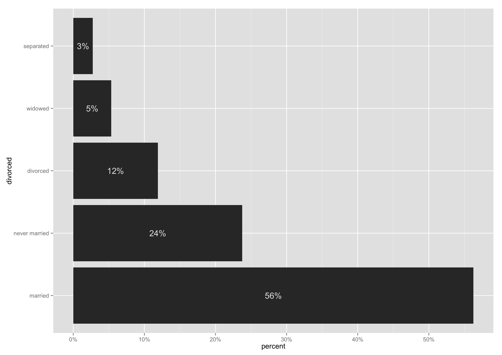
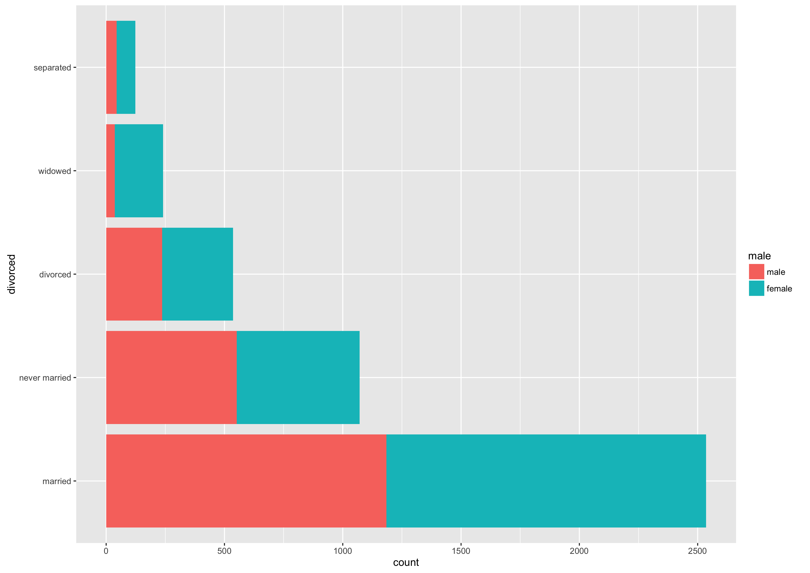
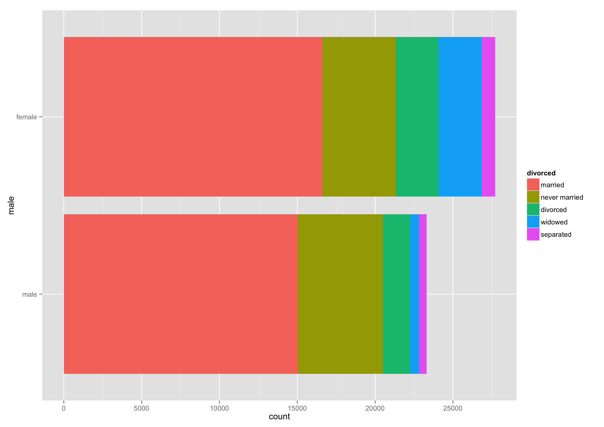
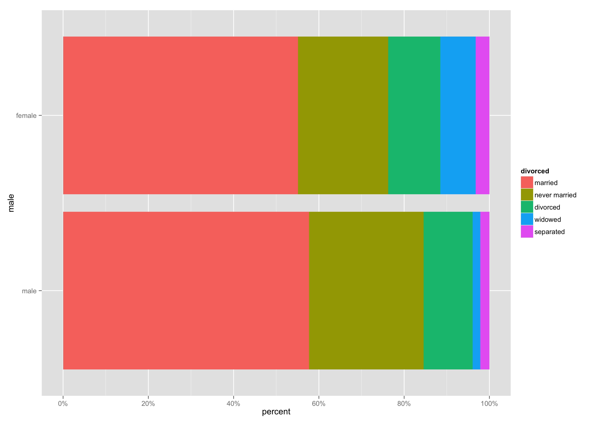

# ggtable: plot tables with ggplot2

__ggtable__ is a wrapper for a family of bar plots that are commonly used with low-dimensional variables from [questionnaire][4dpc] or survey data. Such variables will use a low number of response items, generally as nominal categories or ordered scales. The bar plots for their frequencies will consist of horizontal bars or stacked bars, using raw counts or percentages.

__See also__ the `vcd` package, the [`likert`][likert] package for more advanced plots with scaled response items, or ways to produce [Marrimekko plots][ds] to plot proportions in nested categorical data. These are all more advanced solutions, as is the [productplots][productplots] package. `ggtable` is just a convenience wrapper to quickly get your bar plots done.

[4dpc]: http://4dpiecharts.com/2010/09/25/visualising-questionnaires/
[likert]: http://jason.bryer.org/likert/
[ds]: http://is-r.tumblr.com/post/33290921643/simple-marimekko-mosaic-plots
[productplots]: https://github.com/hadley/productplots

The examples below use the General Social Survey data bundled with the `Gally` package:

```{r}
data(happy, package = "GGally")
happy = subset(happy, year == 2006)
```

Note that the data are weighted, so all examples use the `weights` argument.

## One-way examples

```{r}
# marital status
ggtable(happy$marital, weights = happy$wtssall)
```



```{r}
# plot as percentages and order the bars by decreasing frequency
ggtable(happy$marital, weights = happy$wtssall, percent = TRUE, order = TRUE)
```



```{r}
# plot as percentages and add labels ending with the '%' suffix
ggtable(happy$marital, weights = happy$wtssall, percent = TRUE, 
			  label = TRUE, append = "%")
```



## Two-way examples

```{r}
# marital status by sex
ggtable(happy$marital, happy$sex, weights = happy$wtssall)
```



```{r}
# reverse tabulation
ggtable(happy$sex, happy$marital, weights = happy$wtssall)
```



```{r}
# plot as percentages
ggtable(happy$sex, happy$marital, weights = happy$wtssall, percent = TRUE)
```



## Options and theming

```{r}
# remove name from color legend, use ColorBrewer palette, use ggplot2 methods
ggtable(happy$degree, happy$health, weights = happy$wtssall, percent = TRUE,
          label = TRUE, name = "", palette = "PRGn") +
    labs(y = NULL, x = NULL, title = "Health status, by education level") +
    theme_bw(16) +
    theme(legend.position = "top", axis.ticks = element_blank())
```


